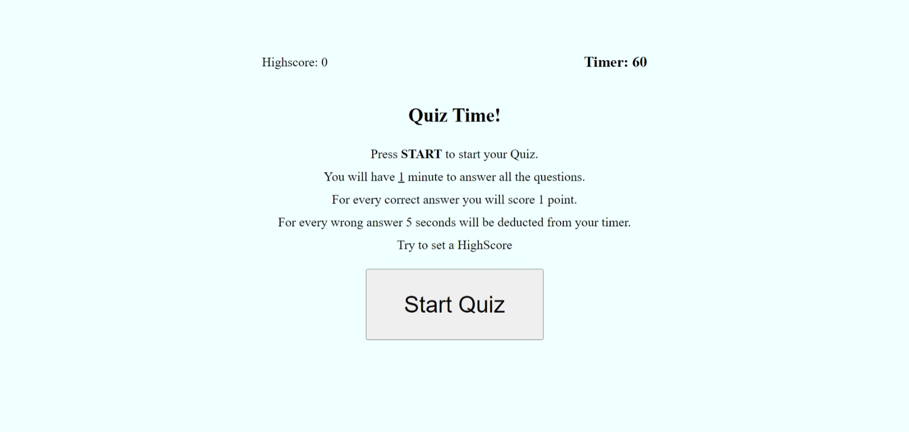

# Quizzzy

## Description

This webpage was made using HTML, CSS, and Javascript. The purpose of this webapge is to allow users to take a timed quiz and score points. For every correct answer the user guesses, the user will receive a point. If the user chooses a wrong answer, 5 seconds will be deducted from the timer. Users will start off with 60 seconds to complete all 8 questions. The goal is to try to get the highest score. 

## Installation

N/A

## Usage

To use this page, press on "START QUIZ" button. This will display the questions and answers for the quiz. Clicking on the answer options will let the user know if they are wrong or right. After a short delay, the next question will appear. Once all the questions are answered or the time has expired, users can submit there name and score to see if they got a highscore by pressing the "Submit button. 
   

## Credits

N/A

## License

N/A